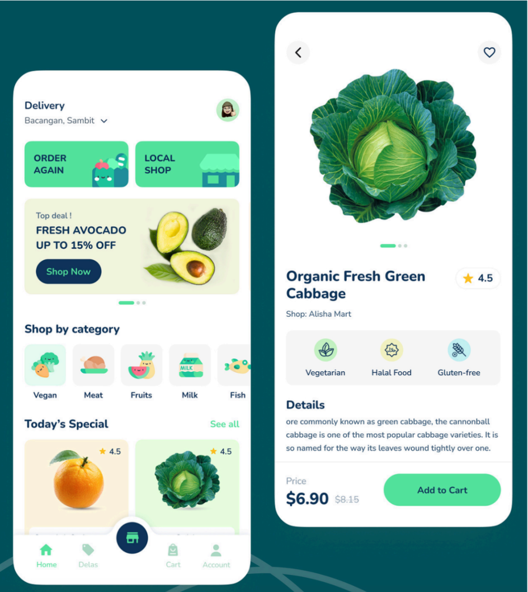

# Bento food challange App

The project consist into a prototype of a grocery shop app, only with navigation interaction and animations to trigger user attention to buttons and offers.

As part of the challange, the app has an interface and interactions based on the image provided below.

- [Click here to access the APK ](https://github.com/CristovoXDGM/bento_challange/releases/tag/v1.0)

As dependencies for the project i'm using `go_router` to manage routes, `flutter_animate` to create smooth animations and to have a collection of icons, i'm using `boxicons`so we can have similar icons as the proposed image of the app.

Since is not a fully function app and is not needed to have complex state management, i have decided to use what flutter has, that is the setState.

To recreate the navigation bar it was used the FlutterShapemaker app that generates the complex ui from an svg file.

The app Creatie was used to create a figma file like and extract the desired collor pattern.

To match the desired font as close as possible, it was used the `Inter` font from google fonts.

For mocked data, it was create a dart file where it has some classes and variables there are beign used to provide info for the fruits and vegetables.

I would like to thank you for the opportunity you are giving me to take part in your selection process. I hope I can pass and join this wonderful team at bento.
